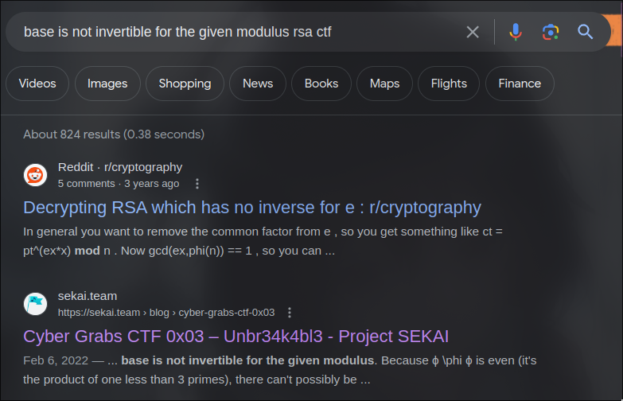
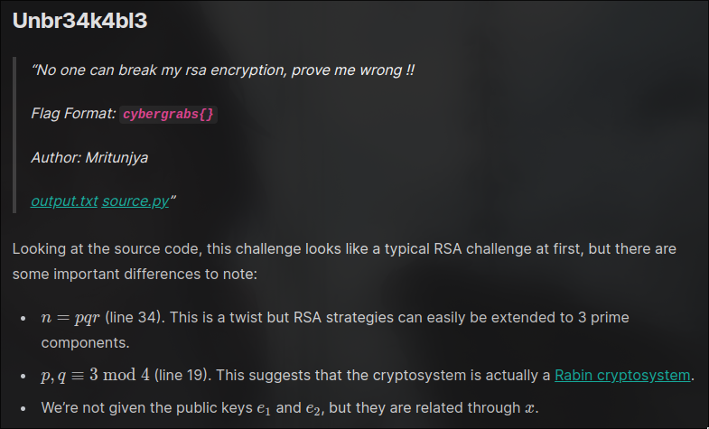

# Confusing Conundrum - Cryptography
## Information about the challenge
- CTF Name : NexZero 2024
- CTF Organizers : Nexus Club
- Category : Cryptography
- Author : M3551
- Points : 482
- Solves : 7/15
- Onsite Players : 15
- Flag Format : nexus{flag}
- Date : 29/02/2024
- Duration : 36 Hours

## Description & Goals
```
Another one, can u decrypt it this time!
NB: Think out of the box!!!
```
also you're given `challenge.txt` file:
```
    p = 94870544634437736510840762818333376841742882634831537595688230105812017096483
    q = 101676806214782912623965046172630710699952727444649297357365091181445815602423
    n = 9646133982286638553098289431708359597742962890715306079129512588482795237366648221809435629553015394294363896520120846912509011493091398851884343959578309
    e = 2
    c = 3119764668748711508220808235240851124304269759793108959684159670352119046143946860636807179972066427531672558917069675705801167306575858295827566698345153
```
## Thought Process
At first, this looked to me like any other RSA square root problem, but when I tried to solve it that way:
```python
from gmpy2 import iroot

k = 0
while True:
    m = iroot(c + n*k, e)
    print(m)
    if m[1]:
        break
    k += 1
```
```
(mpz(55854853582734522357809129742557039947334361168021548250253004889121566333505), False)
(mpz(112986276383618156926227957736535858120845418063525123928088322813276018574322), False)
(mpz(149706488280641960339278940254026120248891349604165395533107179054588818400785), False)
(mpz(179047945019228375302341353634631883026454826517947125286215469510451993689209), False)
(mpz(204216308354389918740039486605307003733472609718676005671085175127705922660826), False)
(mpz(226606342762469701073838900630048119166152681849164463203802824085825767449523), False)
(mpz(246974833864644077073231920775648396963191525563370707763232476311983080919107), False)
(mpz(265786949538074915202823258049954003943330571768156109518246211431169390287958), False)
(mpz(283352848101164883867291833186418307134385673287887923627294907394128212079316), False)
(mpz(299891597930532989592592299944450590760362347626341880994895565475135095130693), False)
.
.
.
```
Infinit loop, it kept going forever.
Then I said to myself, let's just solve it the proper way, let's find the private key.

```python
phi = (p-1) * (q-1)
d = pow(e, -1, phi)
```
```
Traceback (most recent call last):
  File "/home/wb21/ctf/nexzero/crypto/confusion_conundrum/sol.py", line 8, in <module>
    d = pow(e, -1, phi)
        ^^^^^^^^^^^^^^^
ValueError: base is not invertible for the given modulus
```
What? This is totally not expected. I tried to look for this error online and here is what i've found: 



I followed [the second link](https://sekai.team/blog/cyber-grabs-ctf-0x03/unbr34k4bl3/):



I tried to calculate `p, q mod 4` in our case:
```python
print(p % 4)
print(q % 4)
```
```
3
3
```
Hmmm, so it has something to do with [Rabin Cryptosystem](https://en.wikipedia.org/wiki/Rabin_cryptosystem) then.

I followed the instructions in the wikipage and I found the flag!
```python
def gcdExtended(a, b): 
    # Base Case 
    if a == 0 : 
        return b,0,1
             
    gcd,x1,y1 = gcdExtended(b%a, a) 
     
    # Update x and y using results of recursive 
    # call 
    x = y1 - (b//a) * x1 
    y = x1 
     
    return gcd,x,y 
 
mp = pow(c, (p+1)//4, p)
mq = pow(c, (q+1)//4, q)

_, yp, yq = gcdExtended(p, q)

r1 = (yp*p*mq + yq*q*mp) % n
r2 = n - r1
r3 = (yp*p*mq - yq*q*mp) % n
r4 = n - r3

print(bytes.fromhex(hex(r1)[2:]))
print(bytes.fromhex(hex(r2)[2:]))
print(bytes.fromhex(hex(r3)[2:]))
print(bytes.fromhex(hex(r4)[2:]))
```
```
b'M\xf2/\xdc\xfe`\x8d\xf4\xf7\x05#\xc7w\xc2\xd3\x8dsEJ\xb1\x8a\xd2P6\xfe\xd6\xb6i\xa8[\xd2 \xdd"_l\x1ari!\xdc\xc2n\x8e|\xd8\xf7\xf7\xb4,\xc1\x16+\x13,\x85\xae8\xb5)\x8dfa\xf9'
b'j;"?\xc6\x87\xe5\x98\x84;4\xa3\xd5\xbd\xc6\x98\xfa\xcd\xd6\xe7\xdc\x0c\x14\x16\xec@I\x8c\xda`\x01s\xc7M\xc9r\xf1N\x94M\xf4\\xX\xb7t\x89\xa6b\xa5\x1b!\xc39D\xc5\xdfxuE7_\x04\xcc'
b'I\xc7\xd9\xa7Qm\x01Y\x19\x0e\xea\x0b\xeaO)\xbe:\xa0\xc2+6\xa7\x04\xfb\x97\xd5\x82\x95!Zr3C\x0e\xc7}\xaa_\x9c\x0eo\xbd\x85\x85\xd2\xec <\xb5pz\xd6\x8c\xeb\x0f\xea,O\xc9\rcd\x05d'
b'nexus{r4b1n_c1ph3r_n07_RSA}aaaaaaaaaaaaaaaaaaaaaaaaaaaaaaaaaaaaa'
```
## The Flag
```
nexus{r4b1n_c1ph3r_n07_RSA}
```